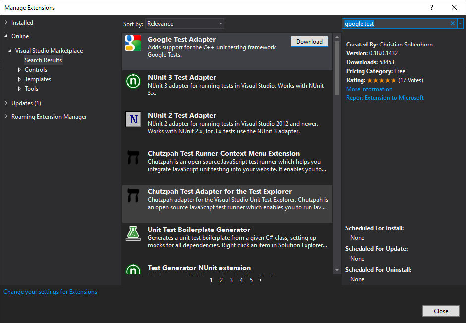

# Model Viewer
CS 561 Software Engineering Methods Project

## Building the Project
This section is for developers. Prebuilt releases: https://github.com/tigerman9854/ModelViewer/releases

### 1. Install Qt
1. Download the Qt Online Installer from the bottom of this page: https://www.qt.io/download-open-source
2. Run the installer. Create a free account and verify your email.
3. Choose C:\Qt as the installation folder. This will guarantee the path length does not exceed the Windows limit.
4. Download the latest release "Qt 5.15.x" and make sure to select the option "MSVC 2019 64-bit".

### 2. Install QT VS Tools
1. Open Visual Studio 2019
2. Navigate to Extensions > Manage Extensions. Search for Qt.

3. Install the extension.
4. Restart Visual Studio.

### 3. Set the Qt Path
1. Open Visual Studio 2019
2. Navigate to Extensions > Qt VS Tools > Qt Options.
3. Add a Qt Version so Visual Studio knows where to look for Qt files. IMPORTANT: To allow each of us to compile without reconfiguring Qt, please name your Qt version exactly "msvc2019_64".

### 4. Google Test
1. Again, navigate to Extensions > Manage Extensions. Search for Google Test.

2. Install the extension.
3. Restart Visual Studio.

### 5. Build
1. Clone the repository.
2. Open "ModelViewer/ModelViewer/ModelViewer.sln" using Visual Studio 2019.
3. Press F5 to build and run.