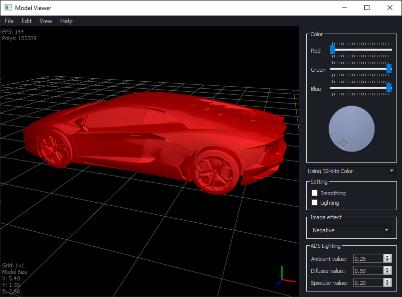

# Model Viewer
CS 561 Software Engineering Methods Project

Download here: https://github.com/tigerman9854/ModelViewer/releases

Model Viewer is a Desktop 3D Model Viewing application which allows users to quickly open and view 3D models from over 50 file formats. It is designed for game developers and graphics programmers who download free models off the internet and want to view or pre-process the model before implementing it into their game or animation.

Model Viewer competes with Microsoft’s 3D Viewer and Google’s web-based model viewer. Our project is innovative because it outperforms the other applications in a few ways.  First, our application supports more filetypes since Microsoft only supports 7 and Google only supports a single proprietary filetype.  Second, our project is open source, unlike Microsoft.  Third, our application supports custom GLSL shaders written by the user so various aspects of the model, such as material qualities and texturing, can be tested before using the model elsewhere.  Fourth, our viewer is lightweight and small, striving for maximum performance with minimal CPU/GPU usage, and a small installation size.

## Building the Project
This section is for developers.

### 1. Install Qt
1. Download the Qt Online Installer from the bottom of this page: https://www.qt.io/download-open-source
2. Run the installer. Create a free account and verify your email.
3. Choose C:\Qt as the installation folder. This will guarantee the path length does not exceed the Windows limit.
4. Download the latest release "Qt 5.15.x" and make sure to select the option "MSVC 2019 64-bit".

### 2. Install QT VS Tools
1. Open Visual Studio 2019
2. Navigate to Extensions > Manage Extensions. Search for Qt.

3. Install the extension.
4. Restart Visual Studio.

### 3. Set the Qt Path
1. Open Visual Studio 2019
2. Navigate to Extensions > Qt VS Tools > Qt Options.
3. Add a Qt Version so Visual Studio knows where to look for Qt files. IMPORTANT: To allow each of us to compile without reconfiguring Qt, please name your Qt version exactly "msvc2019_64".

### 4. Build
1. Clone the repository.
2. Open "ModelViewer/ModelViewer/ModelViewer.sln" using Visual Studio 2019.
3. Press F5 to build and run.
